[](https://git.io/typing-svg)
<h3 align="center">Hi there! I'm a Himanshu Chandola 👨🏻‍💻 currently working as Software Developer 🎓 who loves to create for the web 🌐.</h3>

<p align="center">
  <a href="mailto:himanshuchandolaofficial@gmail.com" target="_blank"></a>
  <a href="https://linkedin.com/in/himanshuchandola" target="_blank"></a>
  <a href="https://himanshuchandola-portfolio.vercel.app/" target="_blank"></a>
  <a href="https://twitter.com/himanshuistaken" target="_blank"></a>
  <a href="https://dev.to/himanshuchandola" target="_blank"></a>
</p>
<p align="center">
 
<a href="https://wakatime.com/@4a55d62c-c22c-4674-abb2-f3837f77a846">
    
</a>
</p>


----
<div align="center">
    <h2>🚀 About Me</h2>
   <p align="center">Frontend Developer with 2+ years in UI design & optimization using React JS & Next JS. Passionate about learning, exploring new tech, & solving real-life problems. Open-source enthusiast & maintainer, inspired by community collaboration and knowledge sharing. </p>
</div>

----

## ⚡ Stuff I Know


[](#)

[](#)


[](#)


----
 &nbsp;&nbsp;&nbsp;&nbsp;If you like what I do, maybe consider buying me a coffee.

&nbsp;&nbsp;&nbsp;&nbsp;<a href="https://www.buymeacoffee.com/himanshuchandola" target="_blank"></a>
<br> 
----

##
___NOTE:___ _Top languages shown below does not indicate my skill level or something like that, like its title - "Most Used Languages", it's just a github metric of which languages I have the most code on Github._

<p align="center">
    <a href="https://github.com/himanshuchandola">
        
    </a>
    <a href="https://github.com/himanshuchandola">
        
    </a>
     <a href="https://github.com/himanshuchandola">
        
    </a>
</p>

<div align="center" style="overflow: hidden;justify-content:space-around;">
  
  
</div>


## 🕑 Wakatime Stats:

<!--START_SECTION:waka-->


**I'm an Early 🐤** 

```text
🌞 Morning    18 commits     ░░░░░░░░░░░░░░░░░░░░░░░░░   2.04% 
🌆 Daytime    429 commits    ████████████░░░░░░░░░░░░░   48.69% 
🌃 Evening    423 commits    ████████████░░░░░░░░░░░░░   48.01% 
🌙 Night      11 commits     ░░░░░░░░░░░░░░░░░░░░░░░░░   1.25%

```
📅 **I'm Most Productive on Friday** 

```text
Monday       141 commits    ████░░░░░░░░░░░░░░░░░░░░░   16.0% 
Tuesday      190 commits    █████░░░░░░░░░░░░░░░░░░░░   21.57% 
Wednesday    131 commits    ███░░░░░░░░░░░░░░░░░░░░░░   14.87% 
Thursday     177 commits    █████░░░░░░░░░░░░░░░░░░░░   20.09% 
Friday       204 commits    █████░░░░░░░░░░░░░░░░░░░░   23.16% 
Saturday     24 commits     ░░░░░░░░░░░░░░░░░░░░░░░░░   2.72% 
Sunday       14 commits     ░░░░░░░░░░░░░░░░░░░░░░░░░   1.59%

```


📊 **This Week I Spent My Time On** 

```text
⌚︎ Time Zone: Asia/Kolkata

💬 Programming Languages: 
No Activity Tracked This Week

🔥 Editors: 
No Activity Tracked This Week

💻 Operating System: 
No Activity Tracked This Week

```


 Last Updated on 13/11/2025
<!--END_SECTION:waka-->

### Summary


*That's all, thanks and have a nice day!*

### Show some ❤️ by starring some of the repositories!

</div>
