[](https://git.io/typing-svg)
<h3 align="center">Hi there! I'm a Himanshu Chandola 👨🏻‍💻 currently working as Software Developer 🎓 who loves to create for the web 🌐.</h3>

<p align="center">
  <a href="mailto:himanshuchandolaofficial@gmail.com" target="_blank"></a>
  <a href="https://linkedin.com/in/himanshuchandola" target="_blank"></a>
  <a href="https://himanshuchandola-portfolio.vercel.app/" target="_blank"></a>
  <a href="https://twitter.com/himanshuistaken" target="_blank"></a>
  <a href="https://dev.to/himanshuchandola" target="_blank"></a>
</p>
<p align="center">
 
<a href="https://wakatime.com/@4a55d62c-c22c-4674-abb2-f3837f77a846">
    
</a>
</p>


----
<div align="center">
    <h2>🚀 About Me</h2>
   <p align="center">Frontend Developer with 2+ years in UI design & optimization using React JS. Passionate about learning, exploring new tech, & solving real-life problems. Open-source enthusiast & maintainer, inspired by community collaboration and knowledge sharing. </p>
</div>

----

## ⚡ Stuff I Know


----

##
___NOTE:___ _Top languages shown below does not indicate my skill level or something like that, like its title - "Most Used Languages", it's just a github metric of which languages I have the most code on Github._

<p align="center">
    <a href="https://github.com/himanshuchandola">
        
    </a>
    <a href="https://github.com/himanshuchandola">
        
    </a>
     <a href="https://github.com/himanshuchandola">
        
    </a>
</p>

<div align="center" style="overflow: hidden;justify-content:space-around;">
  
  
</div>

<!--START_SECTION:waka-->


**I'm a Night 🦉** 

```text
🌞 Morning    24 commits     █░░░░░░░░░░░░░░░░░░░░░░░░   4.49% 
🌆 Daytime    115 commits    █████░░░░░░░░░░░░░░░░░░░░   21.5% 
🌃 Evening    391 commits    ██████████████████░░░░░░░   73.08% 
🌙 Night      5 commits      ░░░░░░░░░░░░░░░░░░░░░░░░░   0.93%

```
📅 **I'm Most Productive on Monday** 

```text
Monday       319 commits    ███████████████░░░░░░░░░░   59.63% 
Tuesday      63 commits     ███░░░░░░░░░░░░░░░░░░░░░░   11.78% 
Wednesday    17 commits     ░░░░░░░░░░░░░░░░░░░░░░░░░   3.18% 
Thursday     76 commits     ███░░░░░░░░░░░░░░░░░░░░░░   14.21% 
Friday       31 commits     █░░░░░░░░░░░░░░░░░░░░░░░░   5.79% 
Saturday     20 commits     █░░░░░░░░░░░░░░░░░░░░░░░░   3.74% 
Sunday       9 commits      ░░░░░░░░░░░░░░░░░░░░░░░░░   1.68%

```


📊 **This Week I Spent My Time On** 

```text
⌚︎ Time Zone: Asia/Kolkata

💬 Programming Languages: 
JavaScript               1 hr 5 mins         ███████████████████████░░   92.13% 
JSON                     3 mins              █░░░░░░░░░░░░░░░░░░░░░░░░   4.29% 
Other                    2 mins              ░░░░░░░░░░░░░░░░░░░░░░░░░   2.82% 
Bash                     0 secs              ░░░░░░░░░░░░░░░░░░░░░░░░░   0.69% 
CSS                      0 secs              ░░░░░░░░░░░░░░░░░░░░░░░░░   0.07%

🔥 Editors: 
VS Code                  1 hr 11 mins        █████████████████████████   100.0%

💻 Operating System: 
Windows                  1 hr 11 mins        █████████████████████████   100.0%

```


 Last Updated on 08/02/2024
<!--END_SECTION:waka-->

### Summary


*That's all, thanks and have a nice day!*

### Show some ❤️ by starring some of the repositories!

</div>
